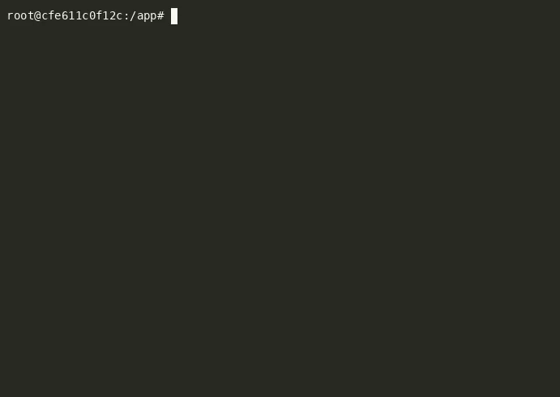

# session-zx — tmux session manager

[](https://github.com/iurev/hoppy/actions/workflows/ci.yml)

A single Go binary that manages tmux sessions with fzf (a fuzzy finder).
It runs inside a `tmux display-popup`.

## Demo

Four real integration tests, played one after another: switch by typing a
name, Ctrl+N preview, killing several sessions with TAB, and the action menu.
Every frame was recorded by the test suite itself.



## Install

Download a binary from the [latest release](https://github.com/iurev/hoppy/releases/latest):

```bash
tar -xzf session-zx_<version>_linux_amd64.tar.gz
install -m755 session-zx ~/.local/bin/
```

Builds are published for linux and macOS, amd64 and arm64.

## Usage

```bash
session-zx switch          # Switch sessions
session-zx new             # Create new session
session-zx rename          # Rename a session
session-zx kill            # Kill sessions
session-zx detach          # Detach sessions
session-zx worktree-switch # Switch within git worktrees
session-zx capital-switch  # Switch to CAPITAL sessions
session-zx popup-switch    # Open in popup window
```

## Core Actions

### 1. Switch Sessions
Change to a different tmux session.

- Shows all sessions in a list
- Sorts by frecency (frequency + recency of use)
- Press 1-9 for quick switch to top 9 sessions
- Press DEL to kill a session
- Press Ctrl+N/Ctrl+P to preview sessions (actually switches to them temporarily)

### 2. New Session
Create a new tmux session.

- Asks for a session name
- Creates and switches to it

### 3. Rename Session
Change a session's name.

### 4. Kill Sessions
Delete one or more sessions.

- Can select multiple sessions with TAB

### 5. Detach Sessions
Disconnect from sessions.

## Special Features

### Worktree Switch
Shows only sessions in git worktrees of current project.

### Capital Switch
Shows only sessions with UPPERCASE names.

### Popup Mode
Opens switcher in a tmux popup window.

## Preview Feature

When you press **Ctrl+N** or **Ctrl+P**:
- The script actually switches to that session temporarily
- You see the real tmux session content
- Keep pressing Ctrl+N/Ctrl+P to preview other sessions
- Press Enter to stay, or Esc to cancel

The script uses a debounce system (300ms delay) to prevent too many rapid switches.

## Technical Details

- Uses frecency scoring (recent usage gets higher priority)
- Validates session names (no special chars, max 100 chars)
- Logs all events to a file
- Adds number prefixes [1]-[9] for quick access

`SPEC.md` describes every behaviour in detail. `ARCHITECTURE.md` describes the
file layout.

## Development

Go and Python run only inside Docker. Never on the host.

```bash
docker compose run --rm build              # compile ./session-zx
docker compose run --rm build go test ./...# Go unit tests
docker compose run --rm test               # 51 integration tests (tmux + fzf)
docker compose run --rm test-record        # same tests, plus .cast recordings
```

Recordings land in `test_output/casts/`. Turn one into a WebP with
`docker compose run --rm media scripts/cast2webp.sh <cast-name>`.

## Releasing

Push a tag. The `Release` workflow cross-compiles, checksums and publishes.
It runs no tests and records nothing.

```bash
git tag v1.0.0 && git push origin v1.0.0
```
